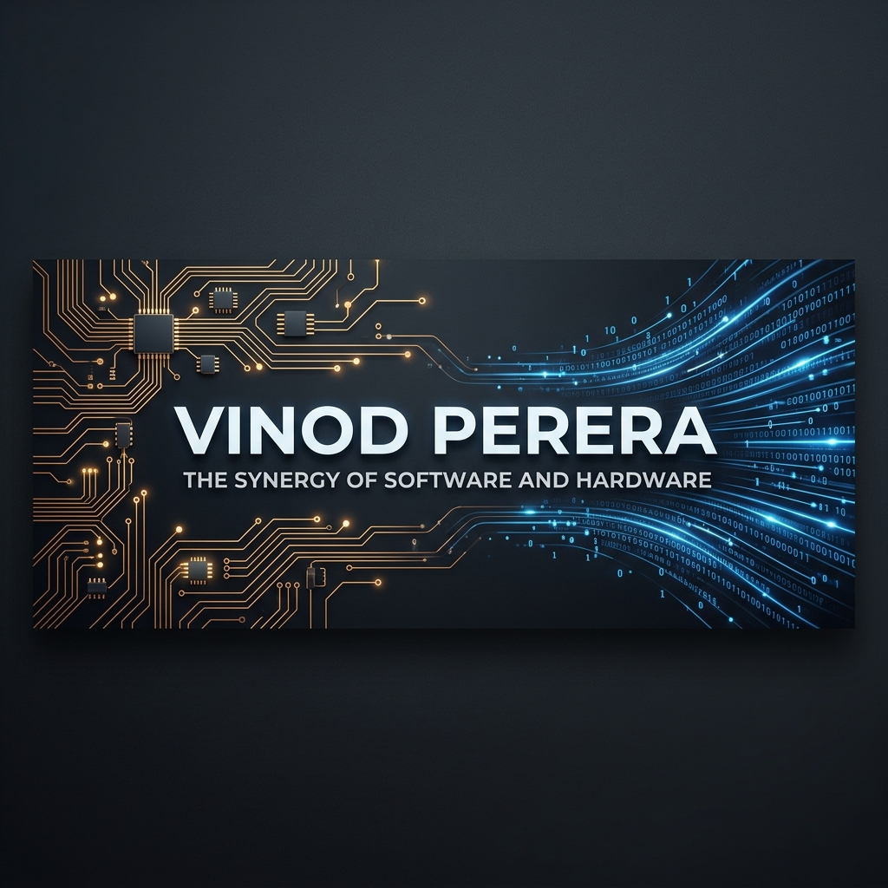

# Vinod Perera

  

<h1 align="center">Hi 👋, I'm Vinod Perera</h1>
<h3 align="center">Software & Hardware Synergy Architect | EEE Undergraduate | Open Source Contributor</h3>

---

# ⚡ Where Hardware Meets Software

I specialize in bridge-building: connecting the physical precision of **Electrical Engineering** with the scale and resilience of **Enterprise Software**. My background as an **Electrical and Electronic Engineer Undergraduate** allows me to approach software architecture with a system-modeling mindset, ensuring efficiency at every layer.

- **System Synergy**: Leveraging control theory and low-level optimization to build high-performance distributed systems.
- **Enterprise IoT**: Using **Java** and **REST APIs** to bridge the gap between industrial hardware sensors and cloud-native dashboards.
- **Resilient Architectures**: Designing self-healing platforms inspired by physical relay logic and fault-tolerant electrical systems.

---

# 🚀 Open Source Impact

### **WSO2 Ecosystem Contributions**
*   **[WSO2 Synapse (Backend)](https://github.com/wso2/wso2-synapse/pull/2538)**: Optimized "Unified Expression" resolution logic in core mediators.
*   **[WSO2 API Manager (Frontend)](https://github.com/wso2/apim-apps/pull/1314)**: Engineered submission-aware validation for critical governance UIs.

---

# 🛠️ Technical Arsenal

### **Software & Cloud**

### **Hardware & Embedded**

> [!TIP]
> **Domain Expertise**: Industrial Automation, PCB Design (KiCad), Real-time Operating Systems, and Multi-protocol API Interactivity.

---

# 🏗️ Featured Projects

### **🚀 DevOps: Self-Healing Platform on AWS EKS**
*Autonomous failure detection and zero-downtime recovery.*
- **Synergy**: Integrated hardware-inspired metrics (Liveness/Readiness) with cloud-native scalability.

### **🛡️ SentinelAI: Autonomous API Security**
*AI-driven security layer for Microservices architectures.*
- **Synergy**: Bridging raw data streams with enterprise security decision logic.

---

# 📈 Professional Analytics

  
  

---

# 🤝 Let's Connect

---

  <i>"Engineering the intersection of the physical and digital worlds."</i> ⚡💻

