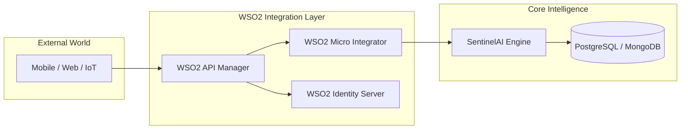

# 👑 Vinod Perera | Perera1325 (Professional Profile)

<!-- ================= 3D HEADER ================= -->

  

<h1 align="center">Hi 👋, I'm Vinod Perera</h1>
<h3 align="center">Dual Degree Undergraduate: CS & EEE | Integration Enthusiast</h3>

---

# 🔭 Focus & Specialization

> "Architecting the future through Integration, Artificial Intelligence, and Electrical Engineering Synergy."

- 🚀 **Goal**: Finalizing my internship application for **WSO2** as an **Integration Engineer**.
- 🔭 **Current**: Deep-diving into **WSO2 API Manager**, **Micro Integrator**, and **Choreo**.
- 🧠 **Research**: AI-Driven Integration (SentinelAI) — Bridging the gap between raw data and enterprise decisions.
- ⚡ **Engineering**: 3rd Year Electrical & Electronic Engineering Undergraduate (SLIIT/Nebula).

---

# 🏗️ Professional Architecture

### **Enterprise Integration & AI System Model**
I specialize in building scalable, secure, and integrated architectures that connect heterogeneous systems.

---

# 🛠️ Technical Arsenal

### 🚀 Integration & Cloud Native

- **Enterprise Middleware**: WSO2 (APIM, MI, IS), Choreo, Ballerina.
- **Architectures**: Microservices, Event-Driven, REST, GraphQL.
- **Cloud/Infra**: AWS, Azure, CI/CD (GitHub Actions), Docker/K8s.

### 💻 Full Stack & Programming

- **Languages**: Java (Spring Boot), Go, Python, Ballerina, JavaScript.
- **Web**: React.js, Node.js, PHP, SCSS.

### 🤖 AI, Security & EEE

- **AI/ML**: Neural Networks, Audio Processing, Predictive Modeling.
- **EE Engineering**: PCB Design (KiCad), Embedded Systems, Control Theory.
- **Cybersecurity**: Secure API Design, Threat Detection, Network Security.

---

# 📈 Contribution Analytics

  
  

### 🐍 Contribution Streak & Activity

  

### 📈 Activity Graph

  

### 🕹️ Contribution Snake

  

---

# 🏆 Featured Projects

- ### 🛡️ **SentinelAI: Autonomous API Security**
  - AI-driven security layer for Microservices architectures.
  - Implemented using WSO2 and advanced ML models.

- ### ☀️ **Hybrid Solar EV Charging Platform**
  - A fusion of Electrical Engineering and Software.
  - Real-time IoT monitoring for renewable energy efficiency.

---

# 🤝 Connect & Collaborate

---

  <i>Combining <b>Hardware Engineering</b> and <b>Enterprise Software</b> to Build Resilient Systems.</i> 🚀

